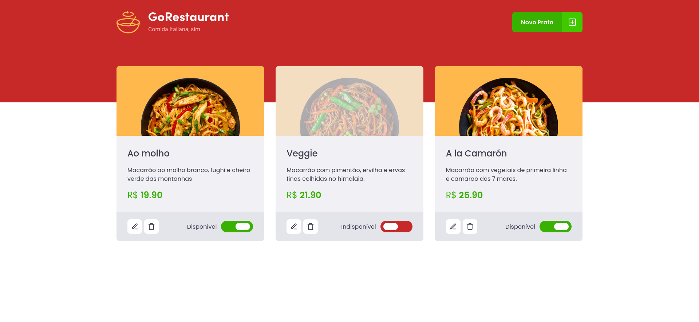

<h1 align="center">

</h1>

<h3>Desafio 4 - Refactoring de classes e typescript</h3>

  

 

  

<h3>Projeto</h3>

Partindo de uma aplicação já funcional, disponível neste <a href="https://github.com/rocketseat-education/ignite-template-reactjs-refactoring-classes-ts" target="_blank" rel="noopener noreferrer"> template</a>, o objetivo do projeto é realizar dois processos de migração: de Javascript para Typescript e de Class Components para Function Components.

Arquivos migrados de Javascript para Typescript e/ou de componentes em classe para componentes funcionais: 

    - src/components/Food/index.jsx
    - src/components/Food/styles.js
    - src/components/Header/index.jsx
    - src/components/Header/styles.js
    - src/components/Input/index.jsx
    - src/components/Input/styles.js
    - src/components/Modal/index.jsx
    - src/components/ModalAddFood/index.jsx
    - src/components/ModalAddFood/styles.js
    - src/components/ModalEditFood/index.jsx
    - src/components/ModalEditFood/styles.js
    - src/pages/Dashboard/index.jsx
    - src/pages/Dashboard/styles.js
    - src/routes/index.jsx
    - src/services/api.js
    - src/styles/global.js
    - src/App.js
    - src/index.js

<h3>Instalação e Execução do Projeto</h3>
<ul>
    <li>Clone o repositório 
    <code>git clone git@github.com:silvacf/desafio-refactoring-de-classes-e-typescript.git</code>
    </li>
    <li>Navegue até o diretório principal 
    <code>cd desafio-refactoring-de-classes-e-typescript</code>
    </li>
    <li>Instale as dependências do projeto 
    <code>yarn</code>
    </li>
    <li>Execute o servidor 
    <code>yarn server</code>
    </li>
    <li>Execute o projeto 
    <code>yarn start</code>
    </li>
</ul>
